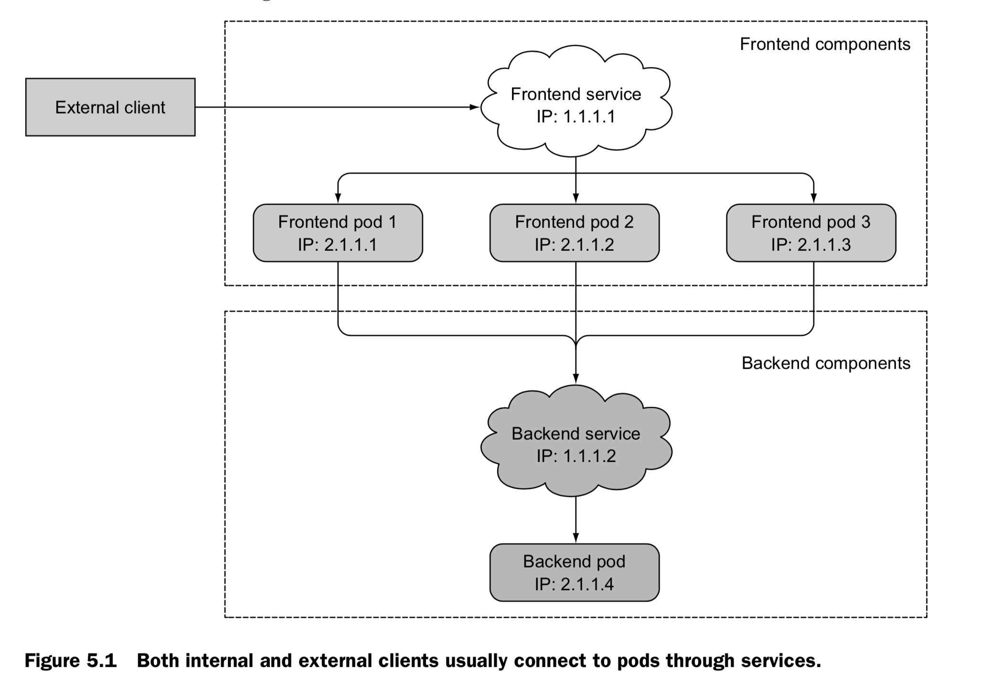
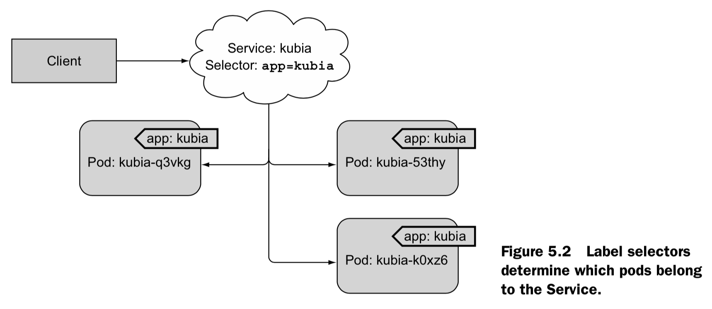

#服务：使客户能够发现并与Pod交谈
本章内容涵盖
>* 创建service资源，利用单个地址访问一组pod
>* 发现集群中的service
>* 将service公开给外部客户
>* 从集群内部连接到外部service
>* 判断Pod是否已准备好成为服务的一部分
>* 排除服务故障

到现在介绍了Pod以及如何通过ReplicaSets和类似资源部署它们以确保它们持续运行。尽管特定的pod可以独立地根据外部激励做出正确的反应，现在大多数应用都是根据外部请求做出回应。例如就微服务而言，pod对来自集群内部的其他pod或者集群外部的客户端的http请求做出回应。

Pod需要找到其他pod的方法如果他们需要使用其他pod提供的服务，不像在没有kubernetes的世界里，系统管理员要在用户端配置文件中明确指出提供服务的精确的IP地址或者主机名来配置每个客户端应用，但是同样的方式在kubernetes中并不适用，因为

* _Pod并不是一成不变的_ —他们可以在任何时候启动或者关闭，无论是因为pod为了给其他pod提供空间被关闭或者主动减少pods的数量还是因为集群中的pod异常结束。
* _Kubernetes在Pod已安排到节点并启动之前为Pod分配IP地址_ —因此客户端不能提前知道提供服务的pod的IP地址
* _横向伸缩(Horizontal scaling)意味着多个pod可以提供相同的服务_ —每个pod都有自己的IP地址，客户端无需关心背后提供服务pod的数量以及各自对应的IP地址。他们无需记录每个pod IP地址。相反，所有的pod可以通过一个单一的IP地址进行访问。

为了解决上述问题，kubernetes也提供了一种资源类型—service，在本章中将对其进行阐述说明。
##5.1 介绍service
Kubernetes service是一种资源，可以为提供同样服务的pod提供单一、常用的接入点。当service存在的情况下，该服务拥有固定的IP地址和端口。客户端通过IP和端口号建立连接，这些连接会被路由到提供该服务的任意一个pod上。通过这种方式，客户端不需要知道每个单独的提供该服务的pod的地址，允许这些pod可以在集群中移入或者移出。

**以示例解读服务**

回顾一下有前端Web服务器和后端数据库服务器的例子。有很多pod提供前端服务，而只有一个pod提供后台数据库服务。需要解决两个问题才能使系统发挥作用。

* 外部服务器连接到pod上，而无需关心有前端web服务器一个还是多个
* 前端的pod需要连接到后台的数据库上。由于数据库运行在一个pod上，它可能会在集群中移来移去，导致IP地址变化。当后台数据库被移动时，无需对前端pod重新配置。

为前端pod创建一个service，并且将其配置成可以在集群外部访问到。外部的客户端利用单一的固定的IP地址来连接这些pod。类似的，可以为后台数据库pod创建service，并为其分配一个固定的IP地址。尽管pod的IP地址会改变，但是service的IP地址固定不变。另外，通过创建service，前端的pod在知道后端的service的名字下可以通过环境变量或者DNS来轻松的访问到。系统中所有的元素都在图5.1中展示出来（两种service，支持这些service的两套pod，以及它们之间的相互依赖关系）

到目前为止了解了service背后的基本理念。那么现在，去深入研究如何创建它们。
##5.1.1 创建service
就像了解到的，service可以由多个pod组成。所有的pod对service的连接负载均衡。但是如何准确的定义哪些pod属于service的一部分，哪些不是？

或许还记得label selecto以及它们在Replication-Controllers和其他Pod控制器中的用法，以指定哪些Pod属于同一组。service以相同的方式使用相同的机制，可以参考图5.2。

在之前的章节中，通过创建replication controller来运行三个pod ，每个pod包含node js 服务。再次创建replication controller并且确认pod启动并且运行，在这个之后为这三个pod创建一个service。



**通过KUBECTL expose创建service**

创建service的最简单方法是通过`kubectl expose`，在第2章中已经使用它将前面创建的ReplicationController可以被访问到。像创建replication controller时使用的pod selector那样，利用`expose`命令和pod selector来创建service资源，从而通过单个的IP和端口来访问所有的pod。

现在，除了使用expose命令之外，可以通过将配置的YAML文件传递到kubernetes API server来手动创建service

**通过YAML描述文件来创建service**

使用以下列表的内容创建一个名为kubia-svc.yaml的文件

代码清单 5.1 service的定义：kubia-svc.yaml

```
apiVersion: v1
kind: Service
metadata:
  name: kubia
spec:
  ports:
  - port: 80             <---------service的可用端口
    targetPort: 8080     <---------service将连接转发到的容器端口
  selector:
app: kubia               <---------具有app=kubia标签的都属于service的一部分
```

创建了一个名叫kubia的service，它将在端口80接受请求并将连接路由到具有label selector是`app=kubia`的pod的8080端口上。

接下来通过使用`kubectl create`发布文件来创建服务.

**检测新的service**

在传递完YAML文件后，可以在命名空间下列出来所有的service资源，并可以发现新的service已经被分配了一个内部的集群IP。

```
$ kubectl get svc
NAME         CLUSTER-IP       EXTERNAL-IP   PORT(S)   AGE
kubernetes   10.111.240.1     <none>        443/TCP   30d
kubia        10.111.249.153   <none>        80/TCP    6m       <-------这个service
```

列表显示service拥有10.111.249.153的IP地址。因为只是集群的IP地址，只能在集群内部可以被访问到。service的主要目标就是使集群内部的其他pod可以访问到当前这组pod，但通常也希望在外部公开（expose）service。如何实现将在之后讲解。现在，从集群内部使用创建好的service并了解service的功能。

**通过内部集群测试service**

在集群内部有若干方法向service发送请求

*  显而易见的方法是创建一个pod ，它将请求发送到service的集群IP并记录响应。可以通过查看pod日志了解service的回复
*  使用`ssh`远程登录到kubernetes节点上，然后使用`curl`命令
*  可以通过`kubectl exec`命令在一个已经存在的pod上执行`curl`命令

针对最后一个选项，学习如何在现有的pod中运行命令。

**在运行的容器中远程执行命令**

可以使用`kubectl exec`命令远程的在一个已经存在的pod容器上执行任何命令。这样就可以很方便了解pod的内容、状态以及环境。用`kubectl get pods`命令列出所有的pods并且选择其中一个作为exec命令的执行目标（在下述例子中，选择`kubia-7nog1` pod作为目标）。也可以获得service的集群（cluster）IP （比如使用`kubectl get svc`命令），当执行下述命令时，请确保替换对应pod的名称以及service IP地址

```
$ kubectl exec kubia-7nog1 -- curl -s http://10.111.249.153
You’ve hit kubia-gzwli
```

如果之前使用过`ssh`命令登录到一个远程系统，会发现`kubectl exec`没有特别大的不同之处

>**为什么是双破折号(-)?**
>
双破折号代表着`kubectl`命令选项的结束。在两个破折号之后的内容是指在pod内部需要执行的命令。如果需要执行的命令并没有以破折号开始的参数，双破折号也不是必须的。如下情况，如果这里不使用双破折号，-s的选项会被解析成`kubectl exec`的选项，会导致结果异常和歧义错误。

```
$ kubectl exec kubia-7nog1 curl -s http://10.111.249.153
The connection to the server 10.111.249.153 was refused – did you
     specify the right host or port?
```
>service拒绝连接之外什么都不做。这是因为kubectl并不能连接到位于10.111.249.153的API server（-s的选项被解析成kubectl的一部分，导致kubectl去连接不同的API server而不是默认值）。


重温一下在运行命令期间发生了什么。图5.3显示了事件的顺序。在一个pod容器上，利用kubernetes去执行curl命令。Curl向service iP发送出一个HTTP请求，service后面三个pod做支撑，kubernetes service 代理截取的该连接，在三个pod中任意选择了一个pod，之后将请求转发给它。在pod中运行的Node js处理请求，并返回带有pod名称的HTPP应答。Curl接收应答并向标准的输出打印，然而应答也kubectl被截取，打印在本地机器的标准输出上。


在之前的例子上，你以独立进程的方式执行了curl命令，但是只是在pod最重要的容器中。这和容器中实际上的主进程service传输信息并没有什么区别。

**在service上配置session affinity**

如果多次执行同样的命令，每次调用执行可能是在不同的pod上。但是如下清单一样，可以将service的sessionAffinity属性设置为ClientIP（而不是None ，None是默认值）来避免此情况的发生。

代码清单5.2 sessionAffinity被设置成ClientIP的service的例子

```
apiVersion: v1
kind: Service
spec:
  sessionAffinity: ClientIP
...
```

这种方式将会使service proxy将来自同一个client ip地址的所有请求转发至同一个pod上。作为练习，创建额外的service并将session affinity设置为ClientIP,并尝试向其发送请求。

kubernetes仅仅支持两种形式的service session affinity：None和ClientIP。或许惊讶竟然不支持基于cookie的session affinity的选项，但是你要了解到kubernetes service不是在http层面上工作。Service处理TCP和UDP包，并不关心其中的载荷内容。因为cookie是http协议中的一部分，service并不知道他们，这就解释了为什么session affinity不能基于cookie。

**同一个service使用多个端口**

你创建的service使用（expose）一个端口，但是service也支持多个端口。比如，你的pod监听两个端口，比如说HTTP的8080和HTTPS的8443，你可以使用一个service从端口80和443转发至pod端口8080和8443。在这种情况下，不需要创建两个不同的服务。通过一个集群IP，在使用一个多端口的service就可以将服务的多个端口全部暴露出来。

> **注意**
> 在创建一个有多个端口的service的时候，必须指定多个端口的名字。

以下列表中显示了支持多端口的service spec：
代码清单5.3 在service定义中指定多端口

```
apiVersion: v1
kind: Service
metadata:
name: kubia
spec: ports:
  - name: http
    port: 80                    <-------
    targetPort: 8080            <-------pod的端口8080映射成端口80
  - name: https
    port: 443                   <-------
    targetPort: 8443            <-------pod的端口8443映射成端口443
  selector:
app: kubia                      <-------label selector适用于整个servcie
```

> **注意**
>  label selector应用于整个service，不能对每个端口做单独的配置。如果不同的pod有不同的端口映射关系，需要创建两个service

之前创建的kubia pod不在多个端口上侦听，因此可以练习创建一个多端口service和一个多端口pod。

**使用命名端口**

在这些例子里，通过数字来指定端口，但是在service spec里也可以给不同的端口号命名，通过名称来指定。这样对一些不是众所周知的端口号的情况下，使得service spec更加清楚。
举个例子，假设你的pod端口定义命名如下表所示：

代码清单5.4 在pod的定义中指定port名称

```
kind: Pod
spec:
  containers:
  - name: kubia
    ports:
    - name: http
      containerPort: 8080        <-------端口8080被命名为http
    - name: https
      containerPort: 8443        <-------端口8443被命名为https
```
可以在service spec中按名称引用这些端口，如下面清单所示：

代码清单5.5 在service中引用命名pod

```
apiVersion: v1
kind: Service
spec:
  ports:
  - name: http
port: 80
    targetPort: http             <-------将端口80映射到容器中被称为http的端口
  - name: https
    port: 443
    targetPort: https            <-------将端口443映射到容器中被称为https的端口
Port 80 is mapped to the container’s port called http.
Port 443 is mapped to the container’s port, whose name is https.
```

为什么要采用命名端口的方式？最大的好处就是即使更换端口号也无需更改service spec。你的pod现在对http服务用的是8080，但是假设过段时间你决定将端口更换为80呢？

但是如果你采用了命名的端口，你仅仅需要做的就是改变pod spec中的端口号（当然你的端口号的名字没有改变）。在你的pod向新端口更新时，根据pod收到的连接(端口8080在旧的pod上，端口80在新的pod上)，用户连接将会转发到对应的端口号上。

##5.1.2 发现服务

通过创建service，现在就可以通过个单一稳定的IP地址访问到pod。在service整个生命周期内这个地址保持不变。在service后面的pod可能消失重建，他们的IP地址可能改变，数量也会增减，但是始终可以通过service的单一不变的IP地址访问到这些pod。

但客户端pod如何知道service的IP和端口？是否需要先创建服务，然后手动查找其IP地址并将IP传递给客户端pod的配置选项？当然不。 Kubernetes还为客户端提供了发现service的IP和端口的方式。

**通过环境变量发现服务**

在pod开始运行的时候，kubernetes会初始化一系列的环境变量指向现在存在的service。如果你创建service早于客户端pod的创建，pod上的进程可以根据环境变量获得service的IP地址和端口号。

在一个运行pod上检查环境，去了解这些环境变量。现在已经了解了通过`kubectl exec`命令在pod上运行一个命令，但是由于service的创建晚于pod的创建的，那么关于这个service的环境变量并没有设置，这个问题也需要被解决。

在查看service的环境变量之前，首先需要删除掉所有的pod使得replicationcontroller创建全新的pod。在无需知道pod的名字的情况下就能删除所有的pod，就像这样：

```
$ kubectl delete po --all
pod "kubia-7nog1" deleted
pod "kubia-bf50t" deleted
pod "kubia-gzwli" deleted
```
现在列出所有新的pod(确信大家知道如何操作)，然后选择一个作为`kubectl exec`命令的执行目标。一旦选择了目标pod，通过在容器里运行`env`来列出来所有的环境变量，如下表所示。

代码清单5.6 容器中和service相关的环境变量

```
$ kubectl exec kubia-3inly env
PATH=/usr/local/sbin:/usr/local/bin:/usr/sbin:/usr/bin:/sbin:/bin
HOSTNAME=kubia-3inly
KUBERNETES_SERVICE_HOST=10.111.240.1 
KUBERNETES_SERVICE_PORT=443
... 
KUBIA_SERVICE_HOST=10.111.249.153 
KUBIA_SERVICE_PORT=80
...
Here’s the cluster IP of the service.
And here’s the port the service is available on.
```
在cluster中定义了两个service：`kubernetes`和`kubia`服务（之前在用`kubectl get svc`命令的时候应该见过）；所以，列表中显示了和这两个service相关的环境变量。在本章开始部分，创建了`kubia` service，在和其有关的环境变量中有KUBIA_SERVICE _HOST 和KUBIA_SERVICE_PORT ，分别代表了`kubia` service的IP地址和端口号。 

回顾本章开始部分的前端-后端的例子，当前端pod需要后端数据库服务pod，可以通过名为`backend-database`的service将后端pod显露(expose)出来，然后前端pod通过环境变量BACKEND\_DATABASE\_SERVICE\_HOST 和 BACKEND\_DATABASE\_SERVIC\E_PORT去获得IP地址和端口信息。
> **注意**
> 服务名称中的破折号被转换为下划线，并且当服务名称用作环境变量名称中的前缀时，所有的字母都是大写的。

环境变量是获得service IP地址和端口号的一种方式，为什么不用DNS域名？为什么kubernetes中没有DNS服务器，并允许通过DNS来获得所有service的IP地址？事实证明，它的确如此！

**通过DNS发现service**

还记得第三章中在`kube-system`命名空间下列出的所有pod的名字吗？其中一个pod被称作`kube-dns`，当前的`kube-system`的命名空间中中也包含了一个具有相同名字的响应service。

就像名字的暗示，这个pod运行DNS服务，在集群中的其他pod都被配置成使用其作为dns（kubernetes通过修改每个容器的`/etc/resolv.conf`文件实现）。运行在pod上的进程DNS查询都会被kubernetes自身的DNS server响应，该服务器知道系统中运行的所有service。

> **注意**
> pod是否使用内部的DNS服务器是根据pod spec中`dnsPolicy`属性来决定的

每个service从内部DNS server中获得一个DNS条目，客户端的pod在知道service名字的情况下可以通过全限定域名（FQDN）来访问,而不是诉诸于环境变量。

**通过FQDN连接服务**

再次回顾前端-后端的例子，前端pod可以通过打开到以下FQDN的连接来访问后端数据库服务：

`backend-database.default.svc.cluster.local`

`backend-database`对应于服务名称，`default`表示服务在其中定义的名称空间，而`svc.cluster.local`是在所有集群本地服务名称中使用的可配置集群域后缀。
> **注意**
> 客户端仍然必须知道service的端口号。如果service使用标准端口号（例如 http的80端口，Postgres的5432端口），这样是没问题的。如果并不是标准端口，客户端可以从环境变量中获取端口号。

连接一个service可能比这更简单。如果前端pod和数据库pod在同一个命名空间下，你可以省略`svc.cluster.local`后缀，甚至命名空间。因此你可以使用`backend-database`来指代service。这是不可思议的简单，不是吗？

尝试一下。尝试使用FQDN来代替IP去访问`kubia`service。另外，必须在一个存在的pod上才能这样做。已经知道通过`kubectl exec`在一个pod的容器上去执行一个简单的命令。但是这一次不是直接的使用`curl`命令，而是使用`bash`shell，这样的话，可以在容器上运行多条命令。在第二章中，当想进入容器时，启动docker时调用`docker exec -it bash`命令，这与此很相似。

**在pod容器上运行shell**

可以通过`kubectl exec`命令在一个pod容器上运行`bash`（或者其他形式的shell）。通过这种方式，可以随意浏览容器，而无需为每个要运行的命令执行`kubectl exec`。
> **注意**
> shell的二进制可执行文件必须在容器映像中可用才能使用。

为了正常的使用shell，`kubectl exec`需要-it选项

```
$ kubectl exec -it kubia-3inly bash
root@kubia-3inly:/#
```
这样的话就处于container内部，根据下述的任何一种方式使用`curl`命令来访问`kubia`service

```
root@kubia-3inly:/# curl http://kubia.default.svc.cluster.local
You’ve hit kubia-5asi2
root@kubia-3inly:/# curl http://kubia.default
You’ve hit kubia-3inly
root@kubia-3inly:/# curl http://kubia
You’ve hit kubia-8awf3
```

在请求的URL中，可以将service的名称作为主机名来访问service。因为根据每个pod容器DNS解析器配置的方式，可以将命名空间和`svc.cluster.local`后缀省略掉。查看一下容器内的`/etc/resilv.conf`文件就明白了。

```
root@kubia-3inly:/# cat /etc/resolv.conf
search default.svc.cluster.local svc.cluster.local cluster.local ...
```

**理解ping不通service的IP**

在继续之前还有最后一问题。了解了如何创建service，所以很快的去自己创建一个。但是，不知道任何原因，无法访问创建的service？

大家可能会尝试通过进入现有的pod，并尝试像上一个示例中那样访问该service来找出问题所在。然后，如果仍然无法使用简单的`curl`命令访问service，也许会尝试ping service IP以查看service是否已启动。现在来尝试一下:

```
root@kubia-3inly:/# ping kubia
PING kubia.default.svc.cluster.local (10.111.249.153): 56 data bytes
^C--- kubia.default.svc.cluster.local ping statistics ---
54 packets transmitted, 0 packets received, 100% packet loss
```

嗯，curl这个service是工作的，但是却ping不通。这是因为service的集群IP是一个虚拟IP，并且只有在与service端口结合时才有意义。将在第11章中解释这意味着什么以及服务是如何工作的。在这里提到这一点，这是因为用户疏于警惕,在尝试调试异常的服务时所做的第一件事。
